<h1>Deep-Dive into the Local Configuration Manager (LCM) Error Flow</h1>

<div style="position:inherit;padding-top:15px;"><span style="float:left;padding-left:15px;"><p><strong>by Nik Charlebois</strong><br />
June 28th, 2024</p></span></div>
<br /><br /><br />
<p>How to handle the error flow when an error is thrown during a deployment of a configuration baseline is an ongoing debate within the config-as-code community. Should you stop the entire deployment flow the moment an error is encountered, or should you allow the process to continue past the error to attempt and deploy other components? This article aims to shed light on how the current Local Configuration Manager (LCM) service handles the error flow in configuration deployment and describes what options are available users to have some control over it.</p>

To better illustrate the options that are available to the users, I’ve created a bogus Desired State Configuration (DSC) module named BlogDSC which contains 2 resources: 1 that will always succeed its execution without errors (WorkingResource), and 1 that will always fail its execution and throw an error (FailingResource). The FailingResource will accept a parameter that will specify in what method the error should be thrown (Get/Set/Test). Both resources will return $false from their Test-TargetResource method in order to allow the LCM flow to call into the Set-TargetResource. Upon entering a method, the module's logic will log an entry in Event Viewer. We will use these event logs to confirm the execution flow of our resources and their methods.

Controlling the error flow in DSC is limited to using the -ErrorAction parameter with Continue or Stop when calling into the Start-DSCConfiguration cmdlet, or by specifying dependencies between resource instances in your configuration using the DependsOn parameter. <strong>One thing that is very important to understand is that the -ErrorAction parameter only takes effect when the Start-DSCConfiguration cmdlet is ran synchronously with the -Wait switch, otherwise the execution will default to -ErrorAction 'Continue'.</strong> For each example below, I will highlight the resources’ methods that were called by the LCM service.

<h2>Example 1a - No Dependencies – Fail in Test – ErrorAction Continue</h2>
In this example, we’ve defined a configuration that defines 3 resource instances, and no inter-dependencies between any of them.


```powershell
    WorkingResource 'Work1'
    {
        Id = 'WorkId1'
        Ensure = 'Present'
    }

    FailingResource 'FailTest1'
    {
        Id           = 'FailId1'
        MethodToFail = "Test"
        Ensure       = 'Present'
    }

    WorkingResource 'Work2'
    {
        Id = 'WorkId2'
        Ensure = 'Present'
    }
```


Based on the above screenshot, we would <strong>assume</strong> that the overall execution flow is the following, in order and where items in green get executed and items in red never get executed:

<ul>
    <li>Work1</li>
    <ul>
        <li><span style ='color:green'>Test</span></li>
        <li><span style ='color:green'>Set</span></li>
    </ul>
    <li>Fail1</li>
    <ul>
        <li><span style ='color:green'>Test</span> (Error thrown)</li>
        <li><span style ='color:red'>Set</span></li>
    </ul>
    <li>Work2</li>
    <ul>
        <li><span style ='color:green'>Test</span></li>
        <li><span style ='color:green'>Set</span></li>
    </ul>
</ul>

Taking a look at Event Viewer, we can confirm the above execution flow:


<hr/>

<h2>Example 1b - No Dependencies – Fail in Test – ErrorAction Stop</h2>
In this example, we’ve are using the same configuration as above, which defines 3 resource instances, and no inter-dependencies between any of them. This time we are specifying the ErrorAction to be <strong>stop</strong>.


```powershell
    WorkingResource 'Work1'
    {
        Id     = 'WorkId1'
        Ensure = 'Present'
    }

    FailingResource 'FailTest1'
    {
        Id           = 'FailId1'
        MethodToFail = "Test"
        Ensure       = 'Present'
    }

    WorkingResource 'Work2'
    {
        Id     = 'WorkId2'
        Ensure = 'Present'
    }
```

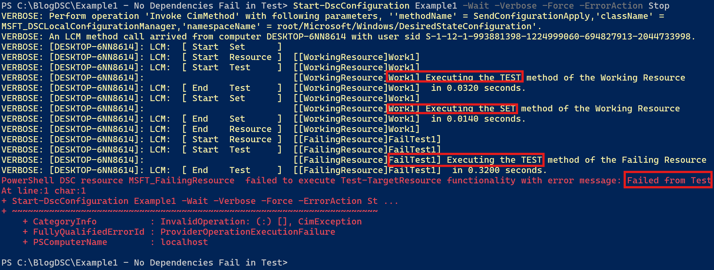

Based on the above screenshot, we would <strong>assume</strong> that the overall execution flow is the following, in order and where items in green get executed and items in red never get executed:

<ul>
    <li>Work1</li>
    <ul>
        <li><span style ='color:green'>Test</span></li>
        <li><span style ='color:green'>Set</span></li>
    </ul>
    <li>Fail1</li>
    <ul>
        <li><span style ='color:green'>Test</span> (Error thrown)</li>
        <li><span style ='color:red'>Set</span></li>
    </ul>
    <li>Work2</li>
    <ul>
        <li><span style ='color:red'>Test</span></li>
        <li><span style ='color:red'>Set</span></li>
    </ul>
</ul>

Taking a look at Event Viewer, we are observing an extra entry being made on the Test method for the Work2 resource instance:

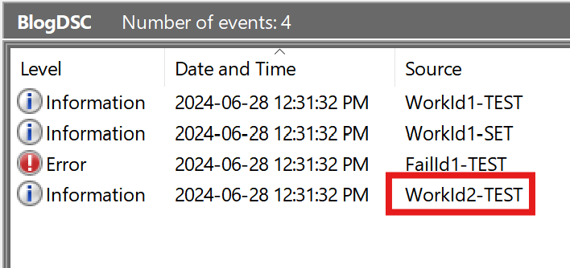

This is due to the fact that even when we specify that we want the synchronous error flow to stop upon encountering the first error, the LCM engine needs to evaluate the remaining instances for drifts. The LCM will not however call into the Set-TargetResource of these resources that are defined past the first failure.

<hr />

<h2>Example 2a - No Dependencies – Fail in Set – ErrorAction Continue</h2>
In this example, we’ve are using the same configuration as above, which defines 3 resource instances, and no inter-dependencies between any of them. We are specifying the ErrorAction to be <strong>continue</strong>.


```powershell
    WorkingResource 'Work1'
    {
        Id     = 'WorkId1'
        Ensure = 'Present'
    }

    FailingResource 'FailTest1'
    {
        Id           = 'FailId1'
        MethodToFail = "Set"
        Ensure       = 'Present'
    }

    WorkingResource 'Work2'
    {
        Id     = 'WorkId2'
        Ensure = 'Present'
    }
```


Based on the above screenshot, we assume that the overall execution flow is the following, in order and where items in green get executed and items in red never get executed:

<ul>
    <li>Work1</li>
    <ul>
        <li><span style ='color:green'>Test</span></li>
        <li><span style ='color:green'>Set</span></li>
    </ul>
    <li>Fail1</li>
    <ul>
        <li><span style ='color:green'>Test</span></li>
        <li><span style ='color:green'>Set</span>(Error thrown)</li>
    </ul>
    <li>Work2</li>
    <ul>
        <li><span style ='color:green'>Test</span></li>
        <li><span style ='color:green'>Set</span></li>
    </ul>
</ul>

Taking a look at Event Viewer, we can confirm the above execution flow:


<hr/>

<h2>Example 2b - No Dependencies – Fail in Set – ErrorAction Stop</h2>
In this example, we’ve are using the same configuration as above, which defines 3 resource instances, and no inter-dependencies between any of them. This time we are specifying the ErrorAction to be <strong>stop</strong>.


```powershell
    WorkingResource 'Work1'
    {
        Id     = 'WorkId1'
        Ensure = 'Present'
    }

    FailingResource 'FailTest1'
    {
        Id           = 'FailId1'
        MethodToFail = "Set"
        Ensure       = 'Present'
    }

    WorkingResource 'Work2'
    {
        Id     = 'WorkId2'
        Ensure = 'Present'
    }
```

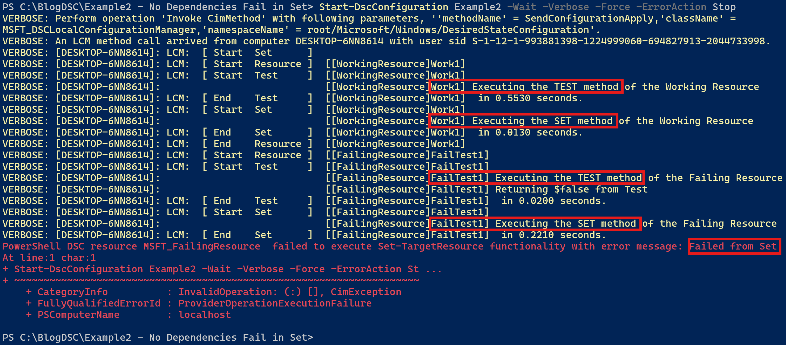

Based on the above screenshot, we would <strong>assume</strong> that the overall execution flow is the following, in order and where items in green get executed and items in red never get executed:

<ul>
    <li>Work1</li>
    <ul>
        <li><span style ='color:green'>Test</span></li>
        <li><span style ='color:green'>Set</span></li>
    </ul>
    <li>Fail1</li>
    <ul>
        <li><span style ='color:green'>Test</span></li>
        <li><span style ='color:green'>Set</span> (Error thrown)</li>
    </ul>
    <li>Work2</li>
    <ul>
        <li><span style ='color:red'>Test</span></li>
        <li><span style ='color:red'>Set</span></li>
    </ul>
</ul>

Taking a look at Event Viewer, we are observing an extra entry being made on the Test method for the Work2 resource instance:

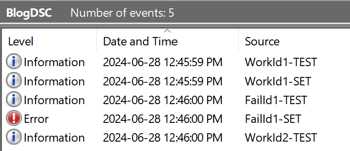

This is due to the fact that even when we specify that we want the synchronous error flow to stop upon encountering the first error, the LCM engine needs to evaluate the remaining instances for drifts. The LCM will not however call into the Set-TargetResource of these resources that are defined past the first failure.

<hr />

<h2>Example 3a - Dependencies Specified – Fail in Test – ErrorAction Continue</h2>
In this example, we’ve defined a configuration that defines 4 resource instances, where the 3rd instance has a dependency on the second one, which will fail in the Test method


```powershell
    WorkingResource 'Work1'
    {
        Id     = 'WorkId1'
        Ensure = 'Present'
    }

    FailingResource 'FailTest1'
    {
        Id           = 'FailId1'
        MethodToFail = "Test"
        Ensure       = 'Present'
    }

    WorkingResource 'Work2'
    {
        Id        = 'WorkId2'
        Ensure    = 'Present'
        DependsOn = "[FailingResource]FailTest1"
    }

    WorkingResource 'Work3'
    {
        Id     = 'WorkId3'
        Ensure = 'Present'
    }
```
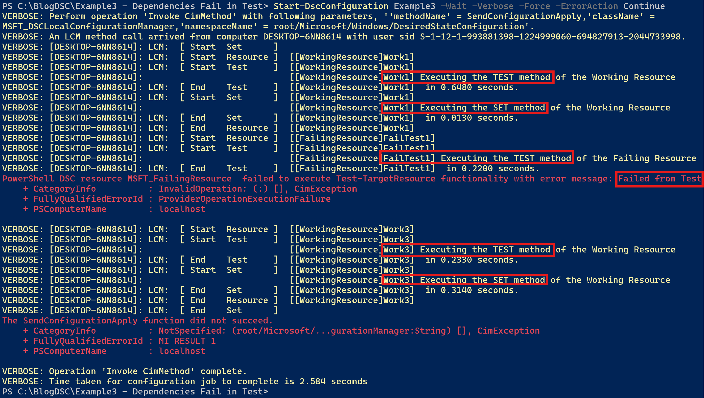

We can see that there is no output in the console for resource Work2. This is due to the fact that this resource depends on the FailTest1 resource which failed. Dependencies are not being executed, even when the ErrorAction parameter is set to continue. However, other resource instances defined on the main sequential path are executed as expected, in this occurence resource Work3.

Based on the above screenshot, we would <strong>assume</strong> that the overall execution flow is the following, in order and where items in green get executed and items in red never get executed:

<ul>
    <li>Work1</li>
    <ul>
        <li><span style ='color:green'>Test</span></li>
        <li><span style ='color:green'>Set</span></li>
    </ul>
    <li>Fail1</li>
    <ul>
        <li><span style ='color:green'>Test</span>(Error thrown)</li>
        <li><span style ='color:red'>Set</span></li>
    </ul>
    <li>Work2</li>
    <ul>
        <li><span style ='color:red'>Test</span></li>
        <li><span style ='color:red'>Set</span></li>
    </ul>
    <li>Work3</li>
    <ul>
        <li><span style ='color:green'>Test</span></li>
        <li><span style ='color:green'>Set</span></li>
    </ul>
</ul>

Taking a look at Event Viewer, we can confirm the above execution flow:
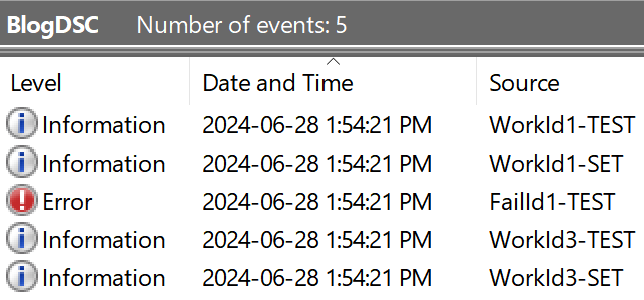

<hr/>

<h2>Example 3b - Dependencies Specified – Fail in Test – ErrorAction Stop</h2>
In this example, we’ve defined a configuration that defines 4 resource instances, where the 3rd instance has a dependency on the second one, which will fail in the Test method. We are also specifying -ErrorAction Stop.


```powershell
    WorkingResource 'Work1'
    {
        Id     = 'WorkId1'
        Ensure = 'Present'
    }

    FailingResource 'FailTest1'
    {
        Id           = 'FailId1'
        MethodToFail = "Test"
        Ensure       = 'Present'
    }

    WorkingResource 'Work2'
    {
        Id        = 'WorkId2'
        Ensure    = 'Present'
        DependsOn = "[FailingResource]FailTest1"
    }

    WorkingResource 'Work3'
    {
        Id     = 'WorkId3'
        Ensure = 'Present'
    }
```
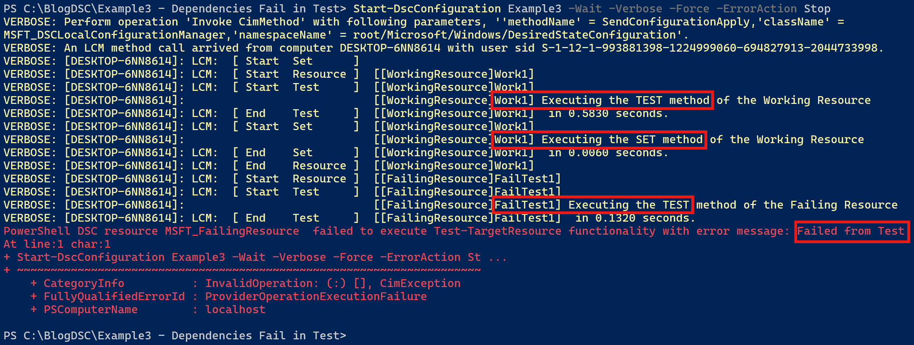

Based on the above screenshot, we would <strong>assume</strong> that the overall execution flow is the following, in order and where items in green get executed and items in red never get executed:

<ul>
    <li>Work1</li>
    <ul>
        <li><span style ='color:green'>Test</span></li>
        <li><span style ='color:green'>Set</span></li>
    </ul>
    <li>Fail1</li>
    <ul>
        <li><span style ='color:green'>Test</span> (Error thrown)</li>
        <li><span style ='color:red'>Set</span></li>
    </ul>
    <li>Work2</li>
    <ul>
        <li><span style ='color:red'>Test</span></li>
        <li><span style ='color:red'>Set</span></li>
    </ul>
</ul>

Taking a look at Event Viewer, we again observe that the other items in the main sequential path have their Test method being executed. Items that are not in the main sequential path don't if their parent dependency failed.


<hr />

<h2>Example 4a - Dependencies Specified – Fail in Set – ErrorAction Continue</h2>
In this example, we’ve defined a configuration that defines 4 resource instances, where the 3rd instance has a dependency on the second one, which will fail in the Set method


```powershell
    WorkingResource 'Work1'
    {
        Id     = 'WorkId1'
        Ensure = 'Present'
    }

    FailingResource 'FailTest1'
    {
        Id           = 'FailId1'
        MethodToFail = "Set"
        Ensure       = 'Present'
    }

    WorkingResource 'Work2'
    {
        Id        = 'WorkId2'
        Ensure    = 'Present'
        DependsOn = "[FailingResource]FailTest1"
    }

    WorkingResource 'Work3'
    {
        Id     = 'WorkId3'
        Ensure = 'Present'
    }
```


We can see that there is no output in the console for resource Work2. This is due to the fact that this resource depends on the FailTest1 resource which failed. Dependencies are not being executed, even when the ErrorAction parameter is set to continue. However, other resource instances defined on the main sequential path are executed as expected, in this occurence resource Work3.

Based on the above screenshot, we would <strong>assume</strong> that the overall execution flow is the following, in order and where items in green get executed and items in red never get executed:

<ul>
    <li>Work1</li>
    <ul>
        <li><span style ='color:green'>Test</span></li>
        <li><span style ='color:green'>Set</span></li>
    </ul>
    <li>Fail1</li>
    <ul>
        <li><span style ='color:green'>Test</span></li>
        <li><span style ='color:green'>Set</span> (Error thrown)</li>
    </ul>
    <li>Work2</li>
    <ul>
        <li><span style ='color:red'>Test</span></li>
        <li><span style ='color:red'>Set</span></li>
    </ul>
    <li>Work3</li>
    <ul>
        <li><span style ='color:green'>Test</span></li>
        <li><span style ='color:green'>Set</span></li>
    </ul>
</ul>

Taking a look at Event Viewer, we can confirm the above execution flow:
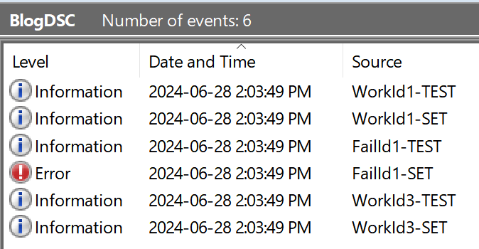

<hr/>

<h2>Example 4b - Dependencies Specified – Fail in Set – ErrorAction Stop</h2>
In this example, we’ve defined a configuration that defines 4 resource instances, where the 3rd instance has a dependency on the second one, which will fail in the Set method. We are also specifying -ErrorAction Stop.


```powershell
    WorkingResource 'Work1'
    {
        Id     = 'WorkId1'
        Ensure = 'Present'
    }

    FailingResource 'FailTest1'
    {
        Id           = 'FailId1'
        MethodToFail = "Set"
        Ensure       = 'Present'
    }

    WorkingResource 'Work2'
    {
        Id        = 'WorkId2'
        Ensure    = 'Present'
        DependsOn = "[FailingResource]FailTest1"
    }

    WorkingResource 'Work3'
    {
        Id     = 'WorkId3'
        Ensure = 'Present'
    }
```
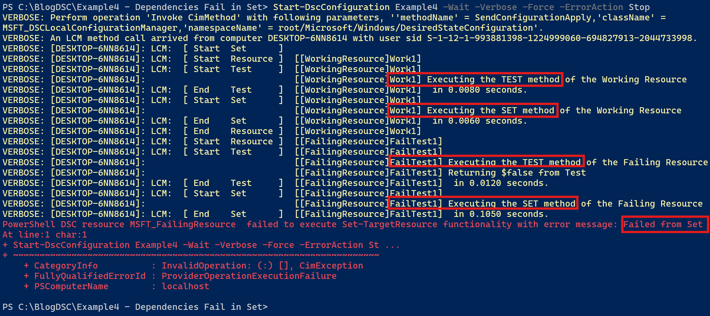

Based on the above screenshot, we would <strong>assume</strong> that the overall execution flow is the following, in order and where items in green get executed and items in red never get executed:

<ul>
    <li>Work1</li>
    <ul>
        <li><span style ='color:green'>Test</span></li>
        <li><span style ='color:green'>Set</span></li>
    </ul>
    <li>Fail1</li>
    <ul>
        <li><span style ='color:green'>Test</span></li>
        <li><span style ='color:green'>Set</span> (Error thrown)</li>
    </ul>
    <li>Work2</li>
    <ul>
        <li><span style ='color:red'>Test</span></li>
        <li><span style ='color:red'>Set</span></li>
    </ul>
    <li>Work3</li>
    <ul>
        <li><span style ='color:red'>Test</span></li>
        <li><span style ='color:red'>Set</span></li>
    </ul>
</ul>

Taking a look at Event Viewer, we again observe that the other items in the main sequential path have their Test method being executed. Items that are not in the main sequential path don't if their parent dependency failed.


<hr />

<h2>Example 5a - Failure in Dependency Chain – ErrorAction Continue</h2>
In this example, we’ve defined a configuration that defines 5 resource instances. We are defining a dependency chain, where one of the links throws a failure.

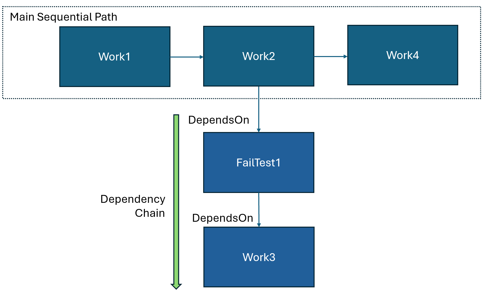

```powershell
    WorkingResource 'Work1'
    {
        Id     = 'WorkId1'
        Ensure = 'Present'
    }

    WorkingResource 'Work2'
    {
        Id           = 'WorkId2'
        Ensure       = 'Present'
    }

    FailingResource 'Fail1'
    {
        Id           = 'Fail1'
        MethodToFail = "Test"
        Ensure       = 'Present'
        DependsOn    = '[WorkingResource]Work2'
    }

    WorkingResource 'Work3'
    {
        Id        = 'WorkId3'
        Ensure    = 'Present'
        DependsOn = "[FailingResource]Fail1"
    }

    WorkingResource 'Work4'
    {
        Id        = 'WorkId4'
        Ensure    = 'Present'
    }
```
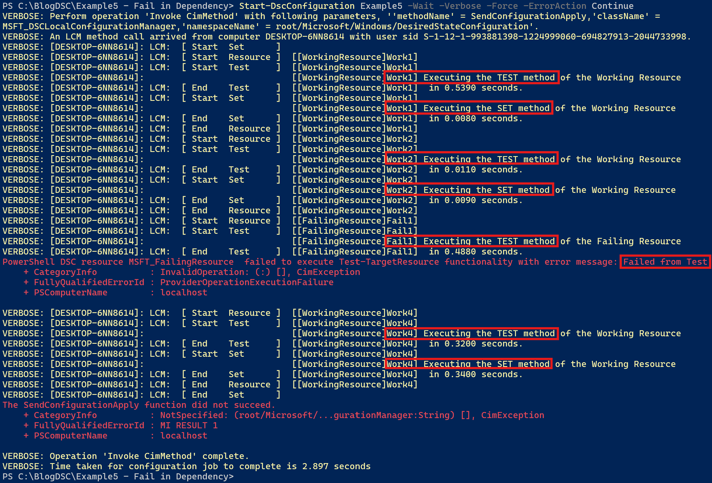

We can see that there is no output in the console for resource Work3. This is due to the fact that this resource depends on the FailTest1 resource which failed. Dependencies are not being executed, even when the ErrorAction parameter is set to continue. However, other resource instances defined on the main sequential path are executed as expected, in this occurence resource Work4.

Based on the above screenshot, we would <strong>assume</strong> that the overall execution flow is the following, in order and where items in green get executed and items in red never get executed:

<ul>
    <li>Work1</li>
    <ul>
        <li><span style ='color:green'>Test</span></li>
        <li><span style ='color:green'>Set</span></li>
    </ul>
    <li>Work2</li>
    <ul>
        <li><span style ='color:green'>Test</span></li>
        <li><span style ='color:green'>Set</span></li>
    </ul>
    <li>Fail1</li>
    <ul>
        <li><span style ='color:green'>Test</span> (Error thrown)</li>
        <li><span style ='color:red'>Set</span></li>
    </ul>
    <li>Work3</li>
    <ul>
        <li><span style ='color:red'>Test</span></li>
        <li><span style ='color:red'>Set</span></li>
    </ul>
    <li>Work4</li>
    <ul>
        <li><span style ='color:green'>Test</span></li>
        <li><span style ='color:green'>Set</span></li>
    </ul>
</ul>

Taking a look at Event Viewer, we can confirm the above execution flow:
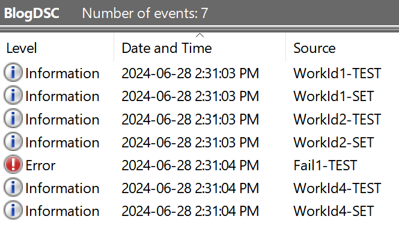

<hr/>

<h2>Example 5b - Failure in Dependency Chain – ErrorAction Stop</h2>
In this example, we’ve defined a configuration that defines 5 resource instances. We are defining a dependency chain, where one of the links throws a failure.


```powershell
    WorkingResource 'Work1'
    {
        Id     = 'WorkId1'
        Ensure = 'Present'
    }

    WorkingResource 'Work2'
    {
        Id           = 'WorkId2'
        Ensure       = 'Present'
    }

    FailingResource 'Fail1'
    {
        Id           = 'Fail1'
        MethodToFail = "Test"
        Ensure       = 'Present'
    }

    WorkingResource 'Work3'
    {
        Id        = 'WorkId3'
        Ensure    = 'Present'
        DependsOn = "[FailingResource]Fail1"
    }

    WorkingResource 'Work4'
    {
        Id        = 'WorkId4'
        Ensure    = 'Present'
    }
```
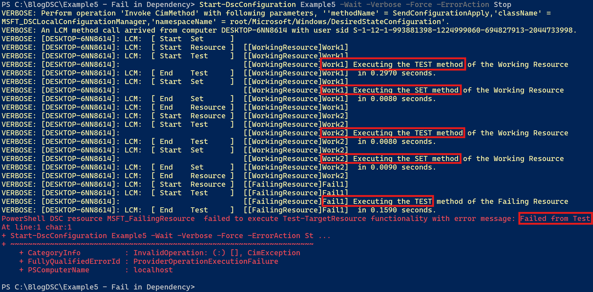

Based on the above screenshot, we would <strong>assume</strong> that the overall execution flow is the following, in order and where items in green get executed and items in red never get executed:

<ul>
    <li>Work1</li>
    <ul>
        <li><span style ='color:green'>Test</span></li>
        <li><span style ='color:green'>Set</span></li>
    </ul>
    <li>Work2</li>
    <ul>
        <li><span style ='color:green'>Test</span></li>
        <li><span style ='color:green'>Set</span></li>
    </ul>
    <li>Fail1</li>
    <ul>
        <li><span style ='color:green'>Test</span> (Error thrown)</li>
        <li><span style ='color:red'>Set</span></li>
    </ul>
    <li>Work3</li>
    <ul>
        <li><span style ='color:red'>Test</span></li>
        <li><span style ='color:red'>Set</span></li>
    </ul>
    <li>Work4</li>
    <ul>
        <li><span style ='color:red'>Test</span></li>
        <li><span style ='color:red'>Set</span></li>
    </ul>
</ul>

Taking a look at Event Viewer, we again observe that the other items in the main sequential path have their Test method being executed. Items that are not in the main sequential path don't if their parent dependency failed.

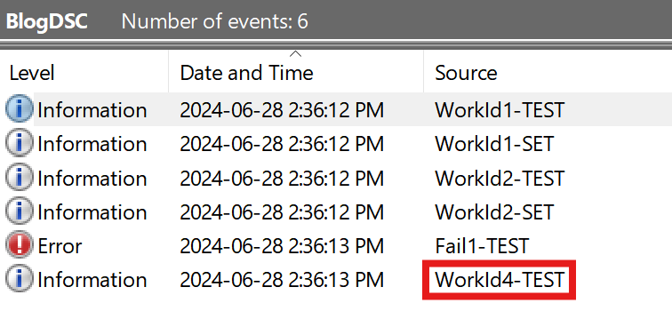

<hr />

<h2>Example 6a - Advanced – ErrorAction Continue</h2>
To summarize what we've covered so far, let's take a look at an advanced scenario:


```powershell
    WorkingResource 'Work1'
        {
            Id     = 'WorkId1'
            Ensure = 'Present'
        }

        WorkingResource 'Work2'
        {
            Id        = 'WorkId2'
            Ensure    = 'Present'
        }

        WorkingResource 'Work3'
        {
            Id        = 'WorkId3'
            Ensure    = 'Present'
            DependsOn = "[WorkingResource]Work2"
        }

        WorkingResource 'Work4'
        {
            Id        = 'WorkId4'
            Ensure    = 'Present'
            DependsOn = "[WorkingResource]Work3"
        }

        FailingResource 'Fail1'
        {
            Id           = 'FailId1'
            MethodToFail = "Test"
            Ensure       = 'Present'
            DependsOn    = "[WorkingResource]Work2"
        }

        WorkingResource 'Work5'
        {
            Id        = 'WorkId5'
            Ensure    = 'Present'
            DependsOn = "[FailingResource]Fail1"
        }
```
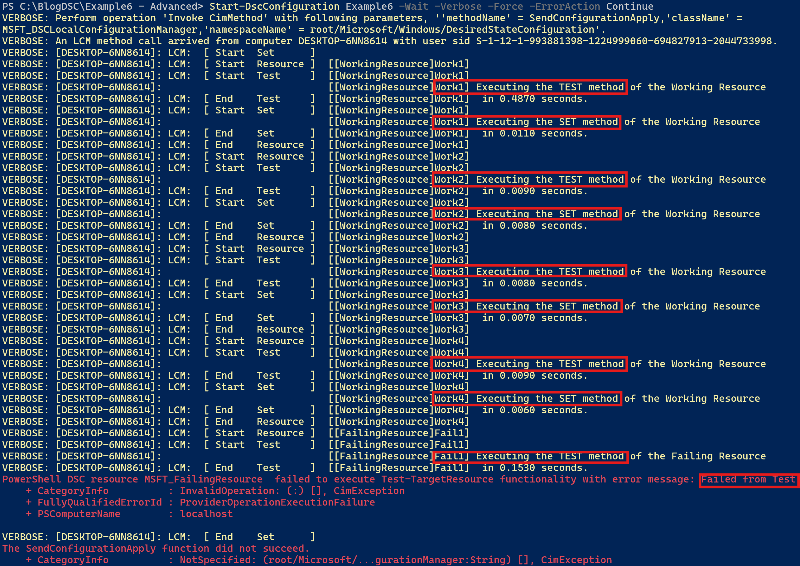

Based on the above screenshot, we would <strong>assume</strong> that the overall execution flow is the following, in order and where items in green get executed and items in red never get executed:

<ul>
    <li>Work1</li>
    <ul>
        <li><span style ='color:green'>Test</span></li>
        <li><span style ='color:green'>Set</span></li>
    </ul>
    <li>Work2</li>
    <ul>
        <li><span style ='color:green'>Test</span></li>
        <li><span style ='color:green'>Set</span></li>
    </ul>
    <li>Work3</li>
    <ul>
        <li><span style ='color:green'>Test</span></li>
        <li><span style ='color:green'>Set</span></li>
    </ul>
    <li>Fail1</li>
    <ul>
        <li><span style ='color:green'>Test</span> (Error thrown)</li>
        <li><span style ='color:red'>Set</span></li>
    </ul>
    <li>Work4</li>
    <ul>
        <li><span style ='color:green'>Test</span></li>
        <li><span style ='color:green'>Set</span></li>
    </ul>
    <li>Work5</li>
    <ul>
        <li><span style ='color:red'>Test</span></li>
        <li><span style ='color:red'>Set</span></li>
    </ul>
</ul>

Taking a look at Event Viewer, we can confirm the above execution flow:


<hr/>

<h2>Example 6b - Advanced – ErrorAction Stop</h2>
To summarize what we've covered so far, let's take a look at an advanced scenario:


```powershell
    WorkingResource 'Work1'
        {
            Id     = 'WorkId1'
            Ensure = 'Present'
        }

        WorkingResource 'Work2'
        {
            Id        = 'WorkId2'
            Ensure    = 'Present'
        }

        WorkingResource 'Work3'
        {
            Id        = 'WorkId3'
            Ensure    = 'Present'
            DependsOn = "[WorkingResource]Work2"
        }

        WorkingResource 'Work4'
        {
            Id        = 'WorkId4'
            Ensure    = 'Present'
            DependsOn = "[WorkingResource]Work3"
        }

        FailingResource 'Fail1'
        {
            Id           = 'FailId1'
            MethodToFail = "Test"
            Ensure       = 'Present'
            DependsOn    = "[WorkingResource]Work2"
        }

        WorkingResource 'Work5'
        {
            Id        = 'WorkId5'
            Ensure    = 'Present'
            DependsOn = "[FailingResource]Fail1"
        }
```
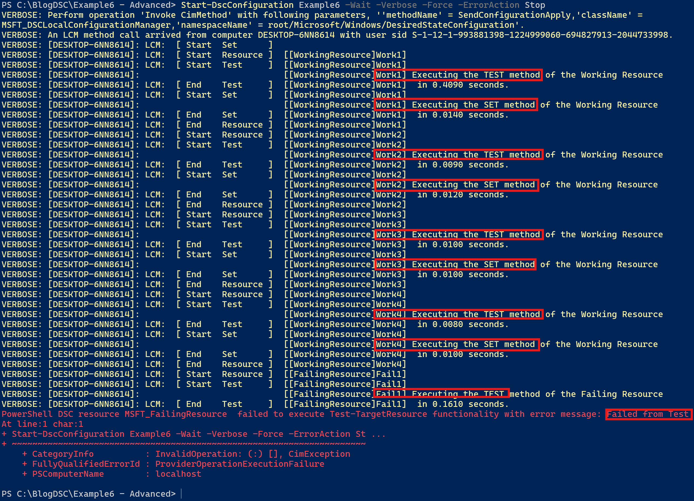

Based on the above screenshot, we would <strong>assume</strong> that the overall execution flow is the following, in order and where items in green get executed and items in red never get executed. <strong>Note:</strong> in this scenario, the outcome is the same as when we used the -ErrorAction parameter with value 'Continue'.

<ul>
    <li>Work1</li>
    <ul>
        <li><span style ='color:green'>Test</span></li>
        <li><span style ='color:green'>Set</span></li>
    </ul>
    <li>Work2</li>
    <ul>
        <li><span style ='color:green'>Test</span></li>
        <li><span style ='color:green'>Set</span></li>
    </ul>
    <li>Work3</li>
    <ul>
        <li><span style ='color:green'>Test</span></li>
        <li><span style ='color:green'>Set</span></li>
    </ul>
    <li>Fail1</li>
    <ul>
        <li><span style ='color:green'>Test</span> (Error thrown)</li>
        <li><span style ='color:red'>Set</span></li>
    </ul>
    <li>Work4</li>
    <ul>
        <li><span style ='color:green'>Test</span></li>
        <li><span style ='color:green'>Set</span></li>
    </ul>
    <li>Work5</li>
    <ul>
        <li><span style ='color:red'>Test</span></li>
        <li><span style ='color:red'>Set</span></li>
    </ul>
</ul>

Taking a look at Event Viewer, we again observe that the other items in the main sequential path have their Test method being executed. Items that are not in the main sequential path don't if their parent dependency failed.


